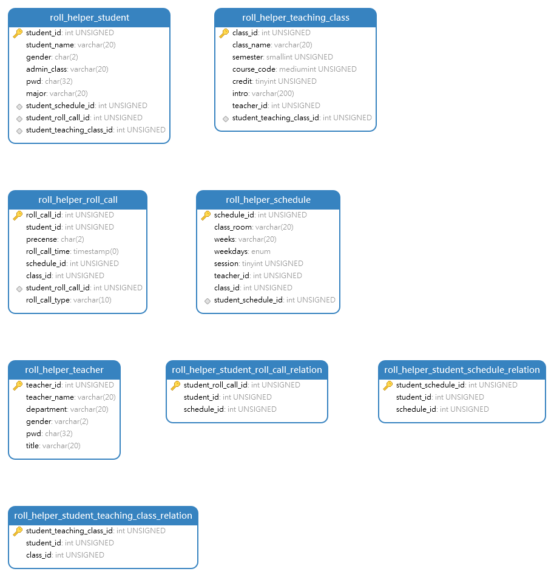

# 建库建表SQL语句

## 创建数据库

```SQL
CREATE DATABASE `roll_helper_db`;
```

## 创建表

### 创建教学班主表

```SQL
CREATE TABLE `roll_helper_db`.`roll_helper_teaching_class` (
    `class_id` INT UNSIGNED ZEROFILL NOT NULL AUTO_INCREMENT COMMENT '课程id',
    `class_name` VARCHAR(20) NOT NULL DEFAULT '' COMMENT '课名',
    `semester` SMALLINT(5) UNSIGNED ZEROFILL NOT NULL COMMENT '学期前4位代表年份，第五位代表第几学期',
    `course_code` MEDIUMINT(7) UNSIGNED ZEROFILL NOT NULL COMMENT '课程代码',
    `credit` TINYINT UNSIGNED NOT NULL COMMENT '学分',
    `intro` VARCHAR(200) NOT NULL COMMENT '课程简介',
    `teacher_id` INT(10) UNSIGNED ZEROFILL NOT NULL COMMENT '教师id',
    `student_teaching_class_id` INT(10) UNSIGNED NOT NULL COMMENT '学生-教学班id',
    PRIMARY KEY (`class_id`),
    UNIQUE KEY `uk_student_teaching_class_id`(`student_teaching_class_id`)
) COMMENT '教学班主表'
```

### 创建学生信息表

```SQL
CREATE TABLE `roll_helper_db`.`roll_helper_student` (
    `student_id` INT(10) UNSIGNED ZEROFILL AUTO_INCREMENT NOT NULL COMMENT '学号',
    `student_name` VARCHAR(20) NOT NULL COMMENT '学生姓名',
    `gender` CHAR(2) NOT NULL COMMENT '性别',
    `admin_class` VARCHAR(20) NOT NULL COMMENT '行政班级',
    `pwd` CHAR(32) NOT NULL COMMENT '密码，md5加密',
    `major` VARCHAR(20) NOT NULL COMMENT '学生专业',
    `student_schedule_id` INT(10) UNSIGNED NOT NULL COMMENT '学生-课表id',
    `student_roll_call_id` INT(10) UNSIGNED NOT NULL COMMENT '学生-点名id',
    `student_teaching_class_id` INT(10) UNSIGNED NOT NULL COMMENT '学生-教学班id',
    PRIMARY KEY(`student_id`),
    UNIQUE KEY `uk_student_schedule_id`(`student_schedule_id`),
    UNIQUE KEY `uk_student_roll_call_id`(`student_roll_call_id`),
    UNIQUE KEY `uk_student_teaching_class_id`(`student_teaching_class_id`)
) COMMENT '学生信息表'
```

### 创建教师信息表

```SQL
CREATE TABLE `roll_helper_db`.`roll_helper_teacher` (
    `teacher_id` INT UNSIGNED ZEROFILL AUTO_INCREMENT NOT NULL COMMENT '教师id',
    `teacher_name` VARCHAR(20) NOT NULL COMMENT '教师姓名',
    `department` VARCHAR(20) NOT NULL COMMENT '教师所属部门',
    `gender` VARCHAR(2) NOT NULL COMMENT '性别',
    `pwd` CHAR(32) NOT NULL COMMENT '教师密码，使用md5加密',
    `title` VARCHAR(20) NOT NULL DEFAULT '' COMMENT '教师职称',
    PRIMARY KEY(`teacher_id`)
) COMMENT '教师信息表'
```

### 创建点名记录表

```SQL
CREATE TABLE `roll_helper_roll_call` (
    `roll_call_id` INT UNSIGNED NOT NULL AUTO_INCREMENT COMMENT '点名id',
    `student_id` INT(10) UNSIGNED ZEROFILL NOT NULL COMMENT '学生学号',
    `precense` CHAR(2) NOT NULL COMMENT '出席情况',
    `roll_call_time` TIMESTAMP DEFAULT CURRENT_TIMESTAMP ON UPDATE CURRENT_TIMESTAMP COMMENT '点名时间',
    `schedule_id` INT(10) UNSIGNED ZEROFILL NOT NULL COMMENT '课表id',
    `class_id` INT UNSIGNED ZEROFILL NOT NULL COMMENT '课程id',
    `student_roll_call_id` INT(10) UNSIGNED NOT NULL COMMENT '学生-点名id',
    PRIMARY KEY(`roll_call_id`),
    UNIQUE KEY `uk_student_roll_call_id`(`student_roll_call_id`)
) COMMENT '点名记录表';
```

### 创建课表记录表

```SQL
CREATE TABLE `roll_helper_db`.`roll_helper_schedule` (
    `schedule_id` INT(10) UNSIGNED ZEROFILL AUTO_INCREMENT NOT NULL COMMENT '课表id',
    `class_room` VARCHAR(20) NOT NULL DEFAULT '' COMMENT '教室，空字符串代表未指定',
    `weeks` VARCHAR(20) NOT NULL DEFAULT '' COMMENT '周次',
    `weekdays` ENUM('周一', '周二', '周三', '周四', '周五', '周六', '周日', '') NOT NULL DEFAULT '' COMMENT '周几, 空字符串代表不确定',
    `session` TINYINT UNSIGNED NOT NULL DEFAULT 0 COMMENT '第几讲，总共1-5讲，0代表不确定',
    `teacher_id` INT(10) UNSIGNED ZEROFILL NOT NULL DEFAULT 0 COMMENT '教师id，0代表没有教师',
    `class_id` INT(10) UNSIGNED ZEROFILL NOT NULL COMMENT '课程id',
    `student_schedule_id` INT(10) UNSIGNED NOT NULL COMMENT '学生表和课表的中间表id',
    UNIQUE KEY `uk_student_schedule_id`(`student_schedule_id`),
    PRIMARY KEY(`schedule_id`)
) COMMENT '教学课表';
```

### 创建学生-课表关系表

```SQL
CREATE TABLE `roll_helper_db`.`roll_helper_student_schedule_relation` (
    `student_schedule_id` INT(10) UNSIGNED NOT NULL AUTO_INCREMENT COMMENT '学生-课表id',
    `student_id` INT(10) UNSIGNED NOT NULL COMMENT '学号',
    `schedule_id` INT(10) UNSIGNED NOT NULL COMMENT '课表id',
    PRIMARY KEY(`student_schedule_id`)
) COMMENT '学生-课表关系表';
```

### 创建学生-点名关系表

```SQL
CREATE TABLE `roll_helper_db`.`roll_helper_student_roll_call_relation` (
    `student_roll_call_id` INT(10) UNSIGNED NOT NULL AUTO_INCREMENT COMMENT '学生-点名id',
    `student_id` INT(10) UNSIGNED NOT NULL COMMENT '学号',
    `schedule_id` INT(10) UNSIGNED NOT NULL COMMENT '点名记录id',
    PRIMARY KEY(`student_roll_call_id`)
) COMMENT '学生-点名关系表';
```

### 创建学生-教学班关系表

```SQL
CREATE TABLE `roll_helper_db`.`roll_helper_student_teaching_class_relation` (
    `student_teaching_class_id` INT(10) UNSIGNED NOT NULL AUTO_INCREMENT COMMENT '学生-教学班id',
    `student_id` INT(10) UNSIGNED NOT NULL COMMENT '学号',
    `class_id` INT(10) UNSIGNED NOT NULL COMMENT '点名记录id',
    PRIMARY KEY(`student_teaching_class_id`)
) COMMENT '学生-教学班关系表';
```

## 模型图


