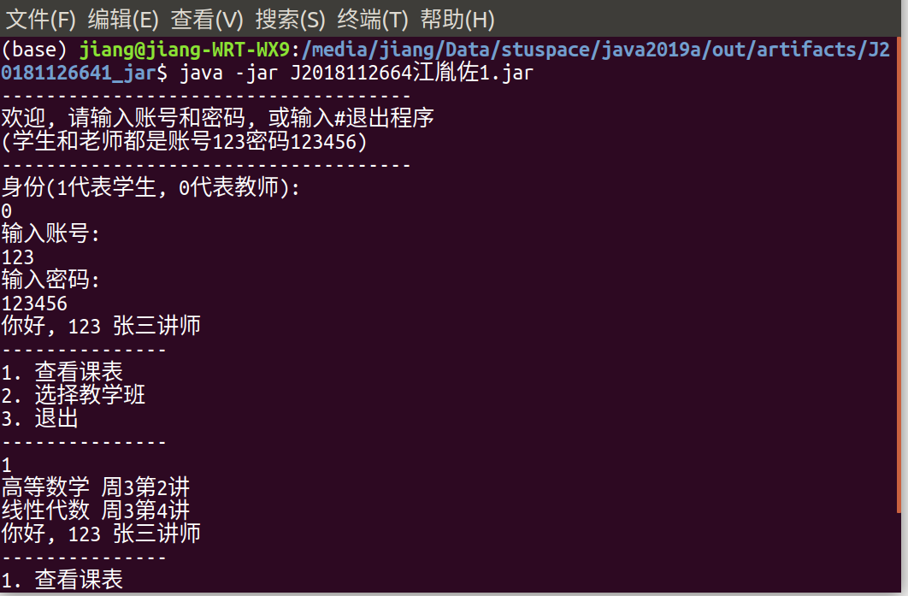
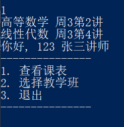
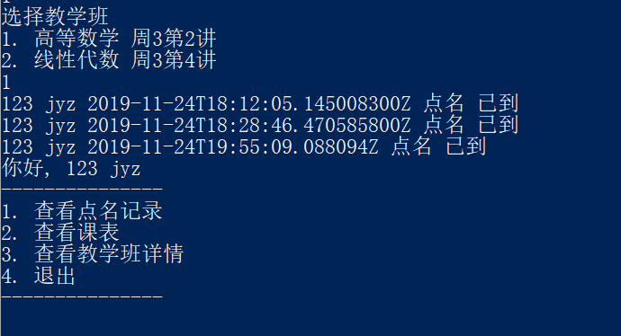
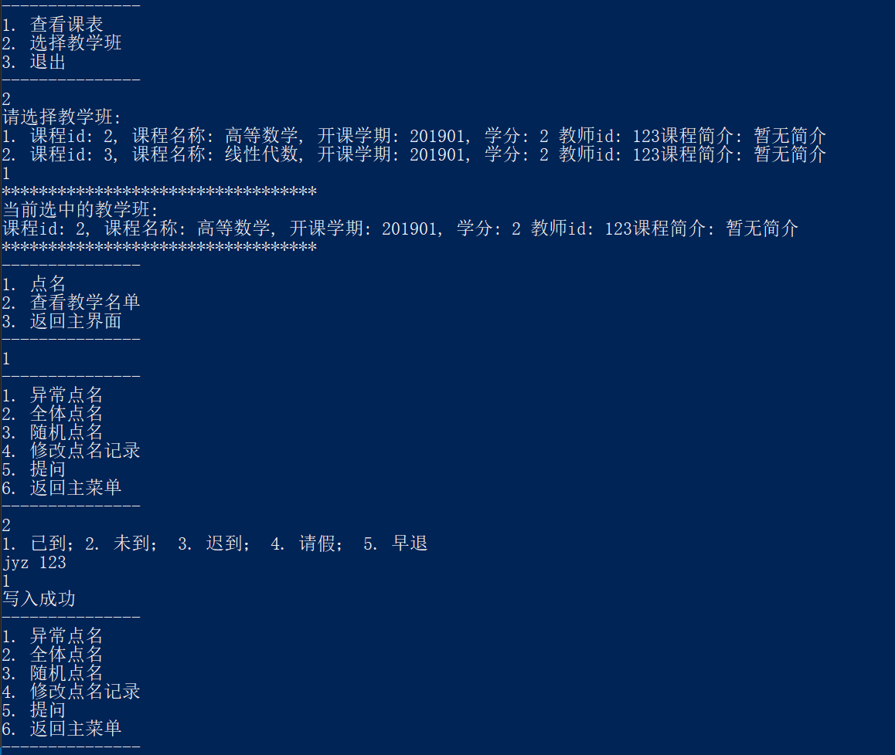

# 课堂点名系统测试报告

## 运行说明

在Release中下载最新版本的J2018112664江胤佐1.zip，解压缩后在当前目录下打开控制台运行jar包。jar包和files文件夹需在同一目录下。

## 程序运行

在Windows PowerShell下执行:
```
java -jar ./J2018112664江胤佐1.jar
```


在Ubuntu下运行:


## 学生登录


## 教师登录


## 查看课表


## 查看点名记录


## 点名

