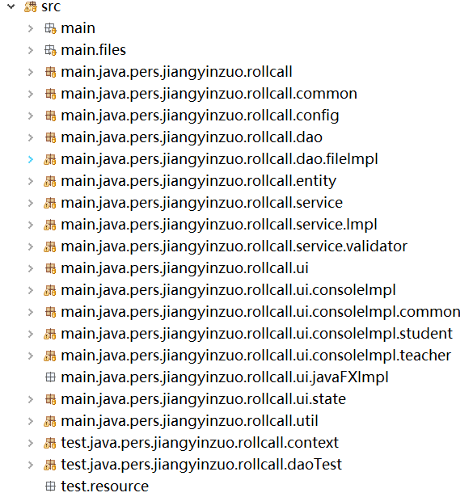

# 课堂点名系统设计大纲

## 需求分析

### 功能需求

学生：查看课表、查看点名记录、查看教学班

教师：查看课表、查看教学班、对每个教学班查看点名记录、发起点名、修改点名记录、发起提问。其中点名包括全体点名、随机点名、异常点名。

### 非功能需求

用户体验良好，程序运行顺畅，程序性能高。

## 系统设计

### 系统目标

实现功能需求、可跨平台使用

### 业务流程

系统流程图如下：
    

### 功能结构

功能结构图：  
  

功能模块说明：
- 用户登录：教师和学生的登录验证
- 查看教学班： 教师查看并操作所教教学班，学生查看所选教学班
- 查看课表：教师和学生查看课表
- 点名：分为随机点名、全体点名、二次点名、异常点名、查看点名情况

### 系统原型

控制台系统原型图如下:
  
	
	

系统界面分为控制台和JavaFx两种。

### 数据设计

#### 数据概念设计

1. 文件通过序列化实体类的方式存储数据；
2. MySql通过关系表的方式存储数据。

#### 数据逻辑设计

逻辑设计见ER图


#### 数据物理设计

1. 文件存储
2. MySQL存储

## 系统架构

系统整体采用mvc架构

### 开发环境

Java版本: JDK11.0.2
IDE: Eclipse

### 设计思想

+ 代码组织架构: MVC分层架构
+ 编程方法: 面向接口，面向对象
+ 设计模式: 工厂模式(切换DAO层和UI+ 层的实现)、单例模式(UI层全局状态管理类)

#### 三层架构（按逻辑分层）

分为用户界面层、业务逻辑层、数据访问层  

##### 用户交互层（UIL）

通常称为表示层，处理用户交互  
用户界面实现技术包括：命令行CLI、图形化GUI（AWT、Swing、JavaFX、Web）  
客户端校验  
控制台-文件程序采用MVC模式，数据模型即Java序列化实体类。

##### 业务逻辑层（BLL）

处理业务逻辑  
应用层+领域层  
服务端校验  

##### 数据访问层（DAL）

持久层  
磁盘文件、 MySQL数据库


## 设计实现

### 程序项目

### 包规划

包规划目录如下图:


```
|--- main: 主程序包
  |--- files: 存放io文件
  |--- java.pers.jiangyinzuo.rollcall: 表示江胤佐的个人项目课堂点名系统
    |--- common: 存放项目的公共类
    |--- config: 项目的配置类
    |--- dao: 项目的DAO层
      |--- fileImpl: dao层的文件存储实现类
    |--- entity: 实体类
    |--- service: 服务层
      |--- Impl: 服务层实现类
      |--- validator: 数据验证器类
    |--- ui: UI层
      |--- consoleImpl: UI层的控制台实现类
        |--- common: 教师和学生的公共UI
        |--- student: 学生UI
        |--- teacher: 教师UI
      |--- javaFXImpl: javaFX实现类
      |--- state: UI全局状态管理
    |--- util: 工具类
|--- test: 测试类包
  |--- java.pers.jiangyinzuo.rollcall: 表示江胤佐的个人项目课堂点名系统
  |--- context: 测试环境上下文
  |--- daoTest: DAO层测试
```

### 数据访问层设计

#### 实体类

实体类有RollCall类、Schedule类、Student类、Teacher类和TeachingClass类，分别代表点名、课表、学生和教师。省略构造方法和getter、setter代码如下。

```Java
// 学生类
public class RollCall implements Serializable {
	private Integer rollCallId;

	/* 已到、未到、迟到、请假、早退 */
	private String presence;
	private String rollCallType;
	private Instant rollCallTime;
	private TeachingClass teachingClass;
	private Student student;
}
```

```Java
// 课表类
public class Schedule implements Serializable {
	public enum WEEKDAY {
		MONDAY("周一"), TUESDAY("周二"), WEDNESDAY("周三"), THURSDAY("周四"), FRIDAY("周五"), SATURDAY("周六"), SUNDAY("周日"),
		DEFAULT("");

		private final String weekday;

		WEEKDAY(String weekday) {
			this.weekday = weekday;
		}

		public String value() {
			return this.weekday;
		}
	}

	private Integer scheduleId;
	private String classRoom;
	private String weeks;
	private WEEKDAY weekday;
	private Short session;
	private Teacher teacher;
	private TeachingClass teachingClass;
}
```

```Java
// 教师类
public class Teacher implements Serializable {
	private Integer teacherId;
	private String teacherName;
	private String department;
	private String gender;
	private String pwd;
	private String title;
	private List<TeachingClass> teachingClassList;
	private List<Schedule> scheduleList;
}
```

```Java
// 教学班类
public class TeachingClass implements Serializable {
	private Integer classId;
	private String className;
	private Integer semester;
	private Integer courseCode;
	private Short credit;
	private String intro;
	private Integer teacherId;
	private List<Schedule> scheduleList;
	private List<Student> studentList;
}
```

```Java
// 点名类
public class RollCall implements Serializable {
	private Integer rollCallId;

	/* 已到、未到、迟到、请假、早退 */
	private String presence;
	private String rollCallType;
	private Instant rollCallTime;
	private TeachingClass teachingClass;
	private Student student;
}
```

#### 数据访问接口

数据访问接口有RollCallDao、StudentDao、TeacherDao和TeachingClassDao

```Java
public interface RollCallDao {

	void insertRollCall(RollCall rollCall) throws IOException;

	void bulkInsertRollCalls(List<RollCall> rollCallList, boolean add) throws IOException;
	
	List<RollCall> queryRollCallsByTeachingClassId(Integer teachingClassId) throws ClassNotFoundException, CustomException, IOException;

	List<RollCall> queryAllRollCalls() throws ClassNotFoundException, IOException;
}
```

```Java
public interface StudentDao {
	/**
	 * 插入学生信息
	 * 
	 * @param student
	 * @return
	 * @throws SecurityException 
	 * @throws NoSuchMethodException 
	 * @throws InvocationTargetException 
	 * @throws IllegalArgumentException 
	 * @throws IllegalAccessException 
	 */
	void insertStudent(Student student) throws IOException, IllegalAccessException, IllegalArgumentException, InvocationTargetException, NoSuchMethodException, SecurityException;
	
	/**
	 * 根据学号查找学生信息
	 * 
	 * @param studentId
	 * @return
	 * @throws IOException 
	 * @throws FileNotFoundException 
	 */
	Student queryStudent(Integer studentId) throws CustomException, FileNotFoundException, IOException;
}
```

```Java
public interface TeacherDao {
	/**
	 * 插入教师
	 * 
	 * @param teacher
	 * @throws IOException
	 * @throws IllegalAccessException
	 * @throws IllegalArgumentException
	 * @throws InvocationTargetException
	 * @throws NoSuchMethodException
	 * @throws SecurityException
	 */
	void insertTeacher(Teacher teacher) throws IOException, IllegalAccessException, IllegalArgumentException,
			InvocationTargetException, NoSuchMethodException, SecurityException;

	/**
	 * 根据id查找老师
	 * 
	 * @param teacherId
	 * @return
	 * @throws CustomException
	 * @throws FileNotFoundException
	 * @throws IOException
	 */
	Teacher queryTeacherById(Integer teacherId) throws CustomException, FileNotFoundException, IOException;
}
```

```Java
public interface TeachingClassDao {
	void insertTeachingClass(TeachingClass teachingClass) throws IOException, IllegalAccessException, IllegalArgumentException,
	InvocationTargetException, NoSuchMethodException, SecurityException;;
	
	List<TeachingClass> queryTeachingClassesByStudentId(Integer studentId) throws FileNotFoundException, ClassNotFoundException, IOException, CustomException;
	
	List<TeachingClass> queryTeachingClassesByTeacherId(Integer teacher) throws FileNotFoundException, ClassNotFoundException, IOException, CustomException;
}
```

#### 基于文件数据访问

AppFile类实现了文件数据访问操作

```Java
package pers.jiangyinzuo.rollcall.util;

import java.io.BufferedReader;
import java.io.EOFException;
import java.io.File;
import java.io.FileInputStream;
import java.io.FileNotFoundException;
import java.io.FileOutputStream;
import java.io.FileWriter;
import java.io.IOException;
import java.io.ObjectInputStream;
import java.io.ObjectOutputStream;
import java.lang.reflect.Field;
import java.lang.reflect.InvocationTargetException;
import java.lang.reflect.Method;
import java.util.ArrayList;
import java.util.List;
import java.util.Scanner;

import pers.jiangyinzuo.rollcall.common.CustomException;
import pers.jiangyinzuo.rollcall.domain.entity.Student;

/**
 * 文件读写类, 负责程序的IO操作
 * 
 * @author Jiang Yinzuo
 *
 */
public class AppFile {
	/**
	 * 全局控制台输入对象
	 */
	public static Scanner scanner = new Scanner(System.in);

	public static int scanItem(int firstItem, int lastItem) {
		String item;
		int result;
		while (true) {
			try {
				item = scanner.nextLine();
				result = Integer.parseInt(item);
				if (firstItem <= result && result <= lastItem) {
					return result;
				} else {
					System.out.printf("请输入数字%d - %d\n", firstItem, lastItem);
				}
			} catch (NumberFormatException e) {
				System.out.printf("请输入数字%d - %d\n", firstItem, lastItem);
			}
		}
	}

	public static String getAppPath() {
		return "D:\\stuspace\\java2019a\\J2018112664江胤佐1\\src\\main\\files\\";
	}

	public static StringBuilder[] parseLine(StringBuilder line, int wordCount) {
		StringBuilder[] result = new StringBuilder[wordCount];
		for (StringBuilder s : result) {
			s = new StringBuilder();
		}
		int idx = 0;
		for (int i = 0; i < line.length(); ++i) {
			if (line.charAt(i) != ',') {
				result[idx].append(line.charAt(i));
			} else {
				++idx;
			}
		}
		return result;
	}

	public static String getLine(BufferedReader br) throws IOException {
		return br.readLine();
	}

	public static void writeEntity(Object obj, String fileName) throws IOException, IllegalAccessException,
			IllegalArgumentException, InvocationTargetException, NoSuchMethodException, SecurityException {
		Class clazz = obj.getClass();
		Field[] classField = clazz.getDeclaredFields();
		String fieldName;
		Method getter;
		String type;

		StringBuilder tempStr = new StringBuilder();
		try (FileWriter fileWriter = new FileWriter(AppFile.getAppPath() + fileName, true);) {
			for (Field field : classField) {
				type = field.getGenericType().toString();
				fieldName = field.getName();
				fieldName = fieldName.substring(0, 1).toUpperCase() + fieldName.substring(1);
				getter = clazz.getMethod("get" + fieldName);

				if (type.startsWith("class")) {
					tempStr.append(getter.invoke(obj).toString());
				} else {
					System.out.println(getter.invoke(obj));
					tempStr.append("[]");
				}
				tempStr.append(",");
			}
			tempStr.append("\n");
			fileWriter.write(tempStr.toString());
		}
	}

	public static void writeSerializableEntity(Object obj, String fileSuffix) throws IOException {
		try (FileOutputStream fileOutputStream = new FileOutputStream(AppFile.getAppPath() + fileSuffix, true);
				ObjectOutputStream objectOutputStream = new ObjectOutputStream(fileOutputStream);) {
			objectOutputStream.writeObject(obj);
			System.out.println("写入成功");
		}
	}


	public static <T> List<T> readAllSerializableEntities(String fileName) throws ClassNotFoundException, IOException {
		List<T> entitiesList = new ArrayList<>();
		Object objFromFile;
		FileInputStream fileInputStream = new FileInputStream(new File(AppFile.getAppPath() + fileName));
		while (fileInputStream.available() > 0) {
			ObjectInputStream objectInputStream = new ObjectInputStream(fileInputStream);

			objFromFile = objectInputStream.readObject();
			entitiesList.add((T) objFromFile);
		}
		fileInputStream.close();
		return entitiesList;
	}
	

	public static <T> void bulkInsertSerializableEntities(String fileSuffix, List<T> objectList, boolean add) throws IOException {
		if (objectList != null) {
			for (Object obj : objectList) {
				try (FileOutputStream fileOutputStream = new FileOutputStream(AppFile.getAppPath() + fileSuffix, add);
						ObjectOutputStream objectOutputStream = new ObjectOutputStream(fileOutputStream);) {
					objectOutputStream.writeObject(obj);
				} catch (IOException e) {
					System.out.println("写入失败, IO异常");
				}
			}
		}
	}

	public static void main(String[] main)
			throws IOException, IllegalAccessException, IllegalArgumentException, InvocationTargetException,
			NoSuchMethodException, SecurityException, ClassNotFoundException, CustomException {

		Student student = new Student(1234, "男", "jyz", "软件2018-01班", "123456", "软件工程", new ArrayList<>(),
				new ArrayList<>(), new ArrayList<>());
		AppFile.writeSerializableEntity(student, "student.txt");
		Student result = (Student) AppFile.readSerializableEntity("student.txt", null, student.getClass());
		System.out.println(result.getStudentName());
	}
}
```

#### 基于Mysql数据访问

#### 数据访问辅助类

Validator接口用于验证数据的合法性或从文件中找到符合查询要求的实体对象

```Java
public interface Validator {
	boolean validate(Class clazz, Object objFromFile, Object... obj) throws CustomException;

	boolean validate(Object objFromFile, Object obj);
}
```

#### 数据访问工厂类

### 业务逻辑层设计

业务逻辑层中，LoginService负责登录业务，RollCallService负责点名业务，StudentService和TeacherService分别负责学生业务与教师业务，UserService负责用户业务。
```Java
public interface LoginService {
	Teacher teacherLogin(Integer teacherId, String pwd) throws CustomException, FileNotFoundException, IOException;

	Student studentLogin(Integer studentId, String pwd) throws CustomException, FileNotFoundException, IOException;
}
```

```Java
/**
 * 点名
 * 
 * @author Jiang Yinzuo
 * 
 */
public interface RollCallService {
	void insertRollCall(Student student, String presence, String rollcallType)
			throws IOException;
	
	void editRollCall(RollCall originRollCall, RollCall rollCall) throws IOException;
	
	void delRollCall(RollCall originRollCall) throws IOException;
	
	void bulkWriteRollCalls(List<RollCall> rollCallList, boolean add) throws IOException;
	
	List<RollCall> queryTeachingClassRollCalls();
	
	List<Student> getAbnormalStudent();
	
	List<Student> getRandomStudent(int count);
}
```

```Java
public interface TeachingClassService {
	List<TeachingClass> queryTeachingClassesByStudentId(Integer studentId)
			throws FileNotFoundException, ClassNotFoundException, IOException, CustomException;

	List<TeachingClass> queryTeachingClassesByTeacherId(Integer teacherId)
			throws FileNotFoundException, ClassNotFoundException, IOException, CustomException;
}
```

```Java
public interface UserService {
	Integer getId();

	void setId(Integer id);

	String getPwd();

	void setPwd(String pwd);

	Short getIsStudent();

	void setIsStudent(Short isStudent);
}
```

### 用户交互层设计

用户交互层有控制台和JavaFx两种实现。可以通过工厂模式+反射+配置类轻松切换。

```Java
/**
 * 工厂模式
 * @author Jiang Yinzuo
 *
 */
public class UIFactory {
	 
	 public UI buildUI(AbstractMenu uiClassName) throws InstantiationException, IllegalAccessException, IllegalArgumentException, InvocationTargetException, NoSuchMethodException, SecurityException, ClassNotFoundException {
		 Class<?> clazz = Class.forName(uiClassName.getMenuClassName());
		 return (UI) clazz.getDeclaredConstructor().newInstance();
	 }
}
```

```Java
/**
 * 本应用程序的配置类
 * @author Jiang Yinzuo
 *
 */
public class Config {
	
	/**
	 * 时区
	 */
	public static final int TIME_ZONE = 8;
	
	/**
	 * UI实现模式, 可根据需要切换
	 */
	public static final String UI_IMPL_CLASS = MainUIConsoleImpl.class.getName();
}
```

#### 用户交互接口

在入口方法中设置While循环，接收用户交互接口以实现菜单的加载。

```Java
public abstract class UI {
	static enum UI_IMPLEMENT {
		CONSOLE, JAVA_FX;
	}
	
	protected UserInfo userInfo;
	
	public abstract AbstractMenu showUI() throws CustomException, FileNotFoundException, IOException;
	
	protected Map<String, AbstractMenu> selectedMenuMap = new HashMap<>();
	
	abstract protected void setSelectedMenuMap();
}
```

```Java
// 整个程序的入口方法
public static void main(String[] args)
        throws ClassNotFoundException, InstantiationException, IllegalAccessException, IllegalArgumentException,
        InvocationTargetException, NoSuchMethodException, SecurityException, CustomException {
    try {
        UIFactory uiFactory = new UIFactory();
        AbstractMenu uiName = MENU.MAIN;
        while (!uiName.getMenuClassName().equals("exit")) {
            UI ui = uiFactory.buildUI(uiName);
            uiName = ui.showUI();
        }
    } catch (StreamCorruptedException e) {
        System.out.println("请清空文件");
    } catch (Exception e) {
        e.printStackTrace();
    } finally {
        AppFile.scanner.close();
    }
}
```

#### 基于控制台的交互

AppFile类用于统一管理控制台的输入输出对象与方法。类代码见上文。

#### 基于Swing的交互

#### 基于JavaFx的交互

## 发布部署
