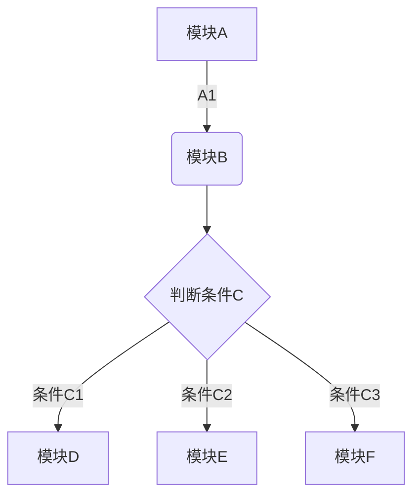

1.Ctrl + Shift + P 调出主命令框，输入 Markdown，应该会匹配到几项 Markdown相关命令
2.先按Ctrl + K，然后放掉，紧接着再按 v，也能调出实时预览框。【要在英文输入状态下】

# markdown 语法

Markdown是一种轻量级标记语言，它以纯文本形式(易读、易写、易更改)编写文档，并最终以HTML格式发布。  
Markdown也可以理解为将以MARKDOWN语法编写的语言转换成HTML内容的工具。  

Markdown语法主要分为如下几大部分： **标题，段落，区块引用，代码区块，强调，列表，分割线，链接，图片，反斜杠 \，符号'`'**。  

markdown快捷键：  

```markdown快捷键
功能        快捷键
加粗        Ctrl + B
斜体        Ctrl + I
引用        Ctrl + Q
插入链接    Ctrl + L
插入代码    Ctrl + K
插入图片    Ctrl + G
提升标题    Ctrl + H
有序列表    Ctrl + O
无序列表    Ctrl + U
横线        Ctrl + R
撤销        Ctrl + Z
重做        Ctrl + Y
```

## 1.标题

用连续一个至六个井号（#）表示一级至六级标题，语法格式：  

```markdown标题格式
# 标题（之间有空格），#个数最多6个，表示6级标题
```

标题语法示例：  

```markdown标题语法示例
# 这是一级标题
## 这是二级标题
### 这是三级标题
#### 这是四级标题
##### 这是五级标题
###### 这是六级标题
```

标题语法效果：  

# 这是一级标题

## 这是二级标题

### 这是三级标题

#### 这是四级标题

##### 这是五级标题

###### 这是六级标题

## 2.分级标题

语法格式：

```markdown分级标题格式
使用=和-标记一级和二级标题。= - 最少可以只写一个，兼容性一般，如：
```

分级标题示例：

``` 分级标题示例
一级标题
===
二级标题
---
```

分级标题示例效果：  

一级标题
===
二级标题
---

## 3.TOC

根据标题生成目录，兼容性一般，如：

[TOC]

## 4.引用

在引用前加大于号。可嵌套若干  
引用的区块内也可以使用其他的 Markdown 语法，包括标题、列表、代码区块等。  

```引用
代码1（单行式），使用 >， 如：  
> Hello
```

引用效果：  
> Hello

```引用
代码2（多行式），使用多行 >，每行后有两个空格，如：
>print  
>func  
>do
```

引用效果：  
>print  
>func  
>do

```引用
代码3（多层嵌套），每层多加一个 >，如：
>class
>>function
>>>function
```

引用效果：  
>class
>>function
>>>function

## 5.行内标记

格式：用`标记代码块将变成一行，如：

标记之外`hello`标记之外

标记之外`
< div>
    < div></div>
    < div></div>
    < div></div>
< /div>
`标记之外

## 6.代码块

### 格式1：用```生成块，与上一行距离一空行

```代码生成块
使用三个反引号把它包起来，如：
<div>
    <div></div>
    <div></div>
    <div></div>
</div>
```

### 格式2，用Tab缩进（或4个空格），空一行

示例...

    <div>
        <div></div>
        <div></div>
        <div></div>
    </div>

### 格式3，自定义语法

在前三个反引号后加入自定义语言，如javascript、sql等，根据不用的语言配置不同的代码着色

```javascript
var num = 0;
for (var i = 0; i < 5; i++) {
    num+=i;
}
console.log(num);
```

### 格式4，行内代码

行内代码用反引号把它包起来（`），如：  

请使用`printf()`函数进行格式化输出  

## 7.插入链接

### 格式1（内链式）（title为可选项）

```内链式链接
[ ]( url "标题"){:target="_blank"}
{:target="_blank"}跳转方式兼容性一般 ，多数第三方平台不支持跳转，如：  
[百度](http://www.baidu.com/ "百度一下")
```

内链式链接效果：  
如：
[百度](http://www.baidu.com/ "百度一下")

### 格式2（引用式）

```引用式链接
[链接文字][id]
[id]: <url> "标题文字"，如：
[百度][1]{:target="_blank"}  
[1]: <http://www.baidu.com/> "百度一下"

[链接文字][]
[链接文字]: <url>
```

引用式链接效果：  
[百度][1]  
[1]:<http://www.baidu.com/> "百度一下"  

[百度][2]  
[百度]:<http://www.baidu.com>  

### 引用相对路径的存储文件

```引用相对路径的存储文件
[链接文字](文件相对路径 "标题文字")， 如：  
[链接文字](../path/file/readme.text "标题文字")
```

引用相对路径的存储文件效果：  
[说明文档](../path/file/readme.text "说明文档")  

### 电子邮件

简短的自动链接形式来处理网址和电子邮件信箱，只要是用<>包起来， Markdown 就会自动把它转成链接。  

```电子邮件
<电子邮件地址>，如：
<example@163.com>  
```

电子邮件效果：  
<example@163.com>

## 8.图片

### 图片内联方式  

```图片内联方式
  

图片替代文字就是显示在图片下面的文字，相当于对图片内容的解释。  
图片标题文字是图片的标题，当鼠标移到图片上时显示的内容。标题文字可加可不加。
图片地址可以是本地存储文件或图片链接地址。如：


插入网络图片：

```

图片内联方式效果：  


### 图片引用方式

```图片引用方式
![替代文字][id]
[id]: 图片地址 "图片标题"
如：
![markdown][1]
[1]: md.jpg "MarkDown"
```

图片引用方式效果（没效果）：  
![markdown][1]  
[1]: md.jpg "MarkDown"  

## 9.字体加粗 斜体 下划线 删除线 分割线

使用星号（*）和下划线（_）包裹，如果要单独使用这两个符号，课使用反斜线（转义符）。如：\*这是转义符\*  

字体加粗：要加粗的文字左右分别用两个星号（*）或两个下划线（_）包起来，语法格式：  

```加粗文本
**加粗的文本**
__加粗的文本__
```

加粗文本效果：  
**加粗的文本**  
__加粗的文本__  

文字斜体：要倾斜的文字左右分别用一个星号（*）号或下划线（_）包起来，语法格式：  

```文字斜体
*斜体文本*
_斜体文本_
```

文字斜体效果：  
*斜体文本*  
_斜体文本_  

文字倾斜加粗：要倾斜和加粗的文字左右分别用三个星号（*）号或下划线（_）包起来，语法格式：  

```文字倾斜加粗
***斜体加粗文本***  
___斜体加粗文本___
```

文字倾斜加粗效果：  
***斜体加粗文本***  
___斜体加粗文本___  

文字下划线：要加下划线的文字左右分别用u标签包起来，语法格式：  

```文字下划线
<u>下划线文本</u>  
```

文字下划线效果：  
<u>下划线文本</u>  

文字加删除线：要加删除线的文字左右分别用两个~~号包起来，语法格式：  

```文字加删除线
~~删除线文本~~
```

文字加删除线效果：  
~~删除线文本~~  

文字分割线：分割线，下边加三个或以上的星号（*），或减号（-）或底线（_），可含空格，语法格式：  

```文字分割线
文字下方分割线
***

文字下方分割线（下方要有空行）

---

文字下方分割线
___
```

文字分割线效果：  

一条华丽的分割线1  
***

一条华丽的分割线2  

---

一条华丽的分割线3  
___

## 文字字体

文字字体设置使用HTML标记（不建议使用），如：  

```文字字体
<font face="黑体">黑体字</font>
```

文字字体效果：

<font face="黑体">黑体字</font>

## 文字颜色

字体颜色设置使用HTML标记（不建议使用），如：  

```文字颜色
<font color=#0000ff>蓝色字</font>
```

文字颜色效果：  
<font color=#0000ff>蓝色字</font>

## 文字字号

字体字号设置使用HTML标记（不建议使用），如： 

```文字字号
<font size=36>36号字</font>
```

文字字号效果：  
<font size=36>36号字</font>

## 换行

连续两个以上空格+回车  

## 首行缩进

首行缩进可以使用一个或连续两个半角或全角的空格符，语法格式：

```首行缩进
&ensp; 半角的空格
&emsp; 全角的空格
```

首行缩进效果：  
&ensp; 半角的空格  
&emsp; 全角的空格  

## 10.符号列表，数字列表

无序列表用 - + * 任何一种都可以，有序列表数字加点，列表嵌套上一级和下一级之间敲三个空格即可。有序列表可以组合无序列表  
列表不光可以单独使用，也可以使用其他的 Markdown 语法，包括标题、引用、代码区块等。  
加粗效果不能直接用于列表标题里面，但是可以嵌套在列表里面混合使用  
列表中包含代码块（前面加2个tab或者8个空格，并且需要空一行，否则不显示）  

### 无序列表（符号列表）

无序列表用* +  - 任何一种都可以（符号后面一定要有一个空格）。列表嵌套上一级和下一级之间敲三个空格即可  

```无序列表
* 无序列表条目
* 无序列表条目
* 无序列表条目
   + 无序列表条目
   + 无序列表条目
   + 无序列表条目
      - 无序列表条目
      - 无序列表条目
      - 无序列表条目
```

无序列表效果：  

* 无序列表条目
* 无序列表条目
* 无序列表条目
   + 无序列表条目
   + 无序列表条目
   + 无序列表条目
      - 无序列表条目
      - 无序列表条目
      - 无序列表条目

### 有序列表

有序列表数字加点（英文句点后面一定要有一个空格），可以组合无序条目。  
有时为了避免数字后的点被转换成有序列表，要使用转义符，如：  
2019\.这不是有序条目  

```有序列表
1. 有序列表条目
2. 有序列表条目
3. 有序列表条目
   * 无序条目
   * 无序条目
```

有序列表效果：  

1. 有序列表条目  
2. 有序列表条目  
3. 有序列表条目
   * 无序条目
   * 无序条目

### 定义型列表

定义型列表由名词和解释组成。一行写上定义，紧跟一行写上解释。解释的写法:紧跟一个缩进(Tab)  

```定义型列表
名词
:   名词解释（冒号后4个空格）
```

定义型列表效果：  

名词  
:    名词解释  

### 列表缩进

列表项目标记通常是放在最左边，但是其实也可以缩进，最多 3 个空格，项目标记后面则一定要接着至少一个空格或制表符。  

```列表缩进
* 列表缩进
列表缩进
* 列表缩进
列表缩进
```

列表缩进效果：  

* 列表缩进  
列表缩进  
* 列表缩进  
列表缩进  

## 11.插入表格 |

表格第一行为表头，第二行分隔表头和主体，第三行开始为表格内容  

```表格
表头|表头|表头
---|:--:|---:
内容|内容|内容
内容|内容|内容

第二行分割表头和内容。
- 有一个就行，为了对齐，多加了几个  
文字默认居左
-两边加：表示文字居中
-右边加：表示文字居右
注：原生的语法两边都要用 | 包起来。此处省略

如：
|表字段1|表字段2|表字段3|
| :- | :-: | -: |
|字段11|字段12|字段13|
|字段21|字段22|字段23|
```

表格效果：  
|表字段1|表字段2|表字段3|
| :- | :-: | -: |
|字段11|字段12|字段13|
|字段21|字段22|字段23|

## 12.插入图表

```插入图表
chart
,预算,收入,花费,债务
June,5000,8000,4000,6000
July,3000,1000,4000,3000
Aug,5000,7000,6000,3000
Sep,7000,2000,3000,1000
Oct,6000,5000,4000,2000
Nov,4000,3000,5000,6000

type: pie
title: 每月收益
x.title: Amount
y.title: Month
y.suffix: $
```

## 13.插入公式

```math
e^{i\pi} + 1 = 0
```

## 14.插入流程图



```flow
st=>start: 开始
op=>operation: My Operation
cond=>condition: Yes or No?
e=>end
st->op->cond
cond(yes)->e
cond(no)->op
&
```

## 15.插入时序图

## 16.插入甘特图
